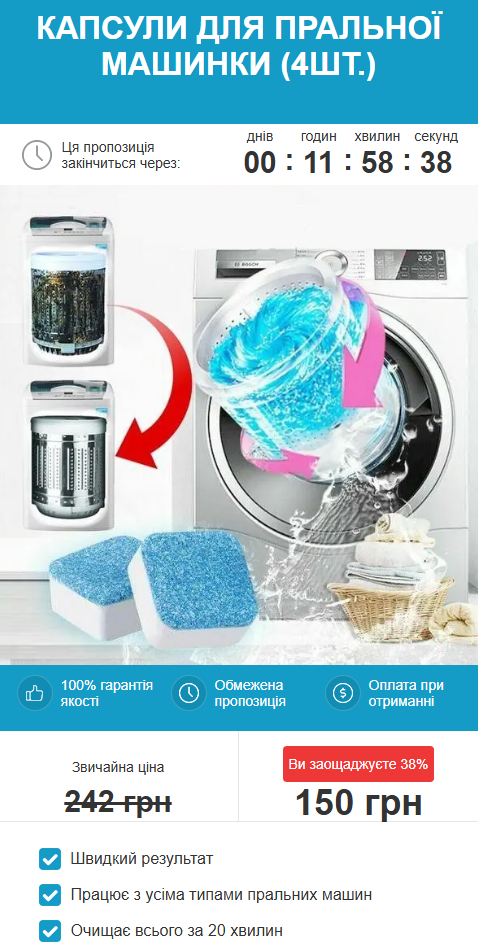

## Hi there 👋
# Here you can see previews of projects made by me and read information about them:     Site-landing "Капсули для пральної машини" https://eco-shop-now.vercel.app/

# Used: Javascript, Node.js, Gulp, SCSS, HTML, vercel serivce for Telegram-bot
## How it works:
1. The project works together with the Telegram bot.
2. When ordering a product, the Telegram bot receives the customer's data - name and phone number for communication.
3. Next, the Telegram bot publishes the customer's data in the Telegram group.
 
 
 
 

# Site-landing "Капсули для пральної машини" https://clone-shop.vercel.app/

# Used: Javascript, Node.js, Gulp, SCSS, HTML, vercel serivce for Telegram-bot
## How it works:
1. The project works together with the Telegram bot.
2. When ordering a product, the Telegram bot receives the customer's data - name and phone number for communication.
3. Next, the Telegram bot publishes the customer's data in the Telegram group.

<!--
**codui/codui** is a ✨ _special_ ✨ repository because its `README.md` (this file) appears on your GitHub profile.

Here are some ideas to get you started:

- 🔭 I’m currently working on ...
- 🌱 I’m currently learning ...
- 👯 I’m looking to collaborate on ...
- 🤔 I’m looking for help with ...
- 💬 Ask me about ...
- 📫 How to reach me: ...
- 😄 Pronouns: ...
- ⚡ Fun fact: ...
-->
